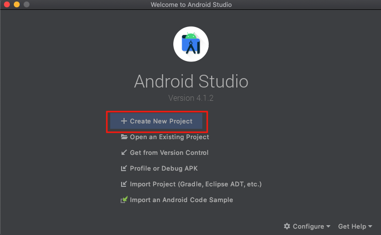
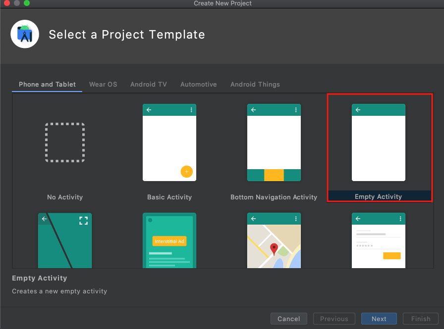
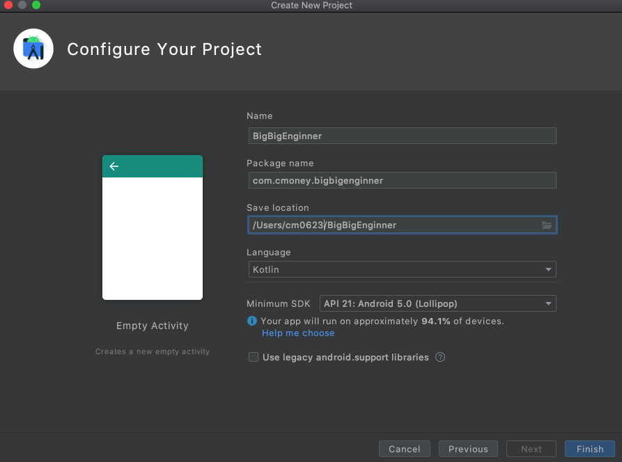

# 建立專案

* Name：放專案資料夾名稱，例如：BigBigEngineer。
* Package Name：專案的名稱，通常會用公司的Domain或是個人Domain。例如：com.cmoney.YOUR\_NAME。
* Save Location：要存放在電腦的位置。
* Language：選擇Kotlin。（不要選Java，後面的課程以Kotlin為主）
* Minimum SDK：App最低可以在哪一個系統版本執行，選擇5.0。在下方會提示你，目前全世界有多少裝置可以執行你的App。

