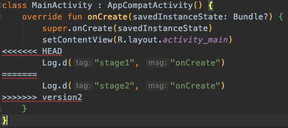
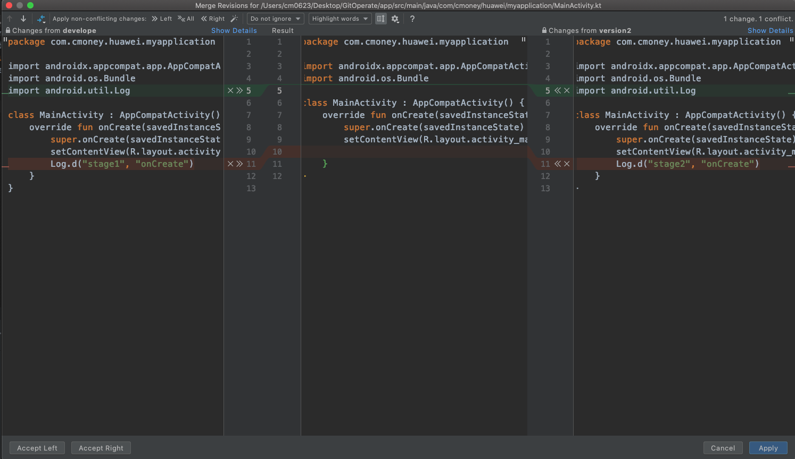

# 解衝突

如果有衝突會產生&lt;&lt;&lt;HEAD ==== &gt;&gt;&gt; 等符號，必須解完才可以合併，不然會產生多餘的錯誤。

使用IDE的比較視窗，左邊是目前的Branch、中間是結果、右邊是要合併進來的Branch。

可以看到上面有x&gt;&gt;、&lt;&lt;x符號，代表將左或右邊的版本移動到中間的結果。

相比原始的方法，需要手動一行一行刪除，方便許多。



