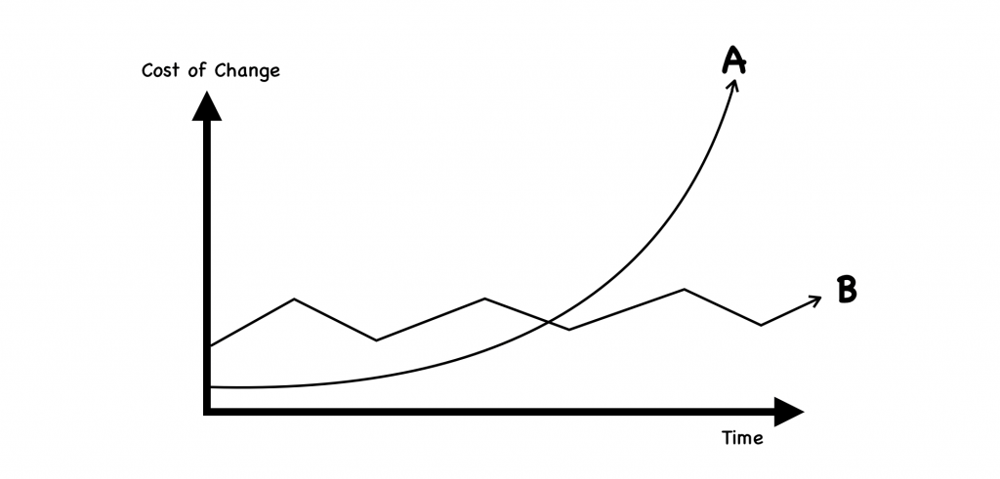
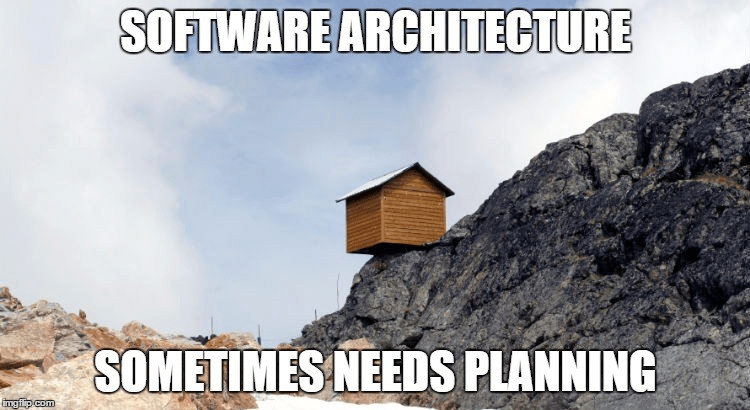
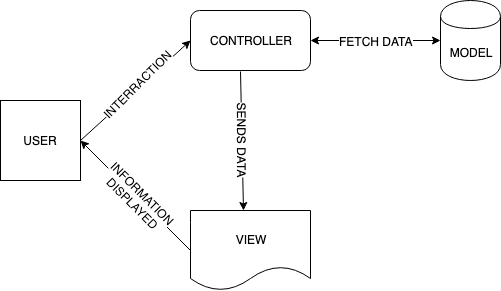
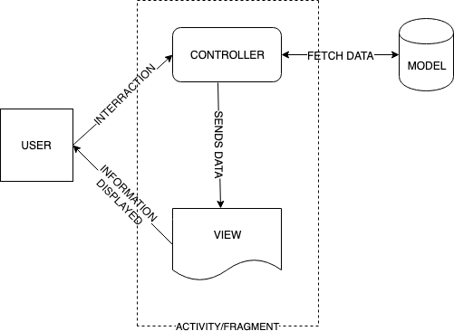
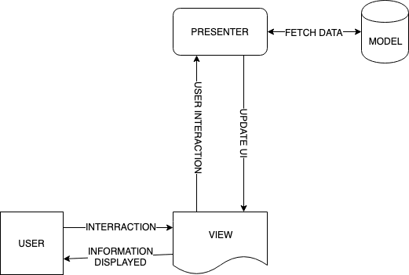
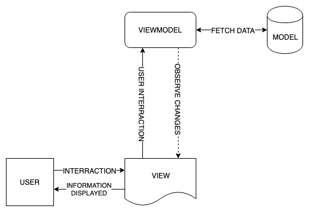

# 架構

## 目錄

* Why
* Clean Architecture
* MVC
* MVP
* MVVM
* More

## Why

* 理論上

> The goal of software architecture is to minimize the human resources required to build and maintain the required system.&#x20;
>
> 軟體架構的目的是最小化建置與維護「需求系統」所需要的人力資源。

* 實務上

讓工程師在開發與之後的維護上能夠花費更少精力，提升軟體開發的效率。如果只是要解決問題，那麼任何架構都可以做到。但好的架構能夠讓改變的成本維持在低處。如果一開始挑一個簡單的架構上路，初期的確成本很低，但是軟體的真正挑戰要從交付後才開始，維護、修改的成本只會逐漸增高，直到最後整個系統動彈不得。如下圖，B相較於A為較好的架構。&#x20;



* 實際上

有人多寫，就會有人少寫。有人少寫，就會有人多寫。



## Clean Architecture



[**Clean Architecture**](https://blog.cleancoder.com/uncle-bob/2012/08/13/the-clean-architecture.html) **是由 Robert C. Martin(Uncle Bob) 在 2012 時所提出的概念。**


#### 原則上分為四個層級：

1. Entities
2. Use Cases
3. Interface Adapters
4. Frameworks & Drivers

### Entities

Entities 指的是我們的核心物件與基礎商業邏輯，像是 user object、password policy、payment api 等跟應用程式無關的核心功能。另一個重點是 Entities 應該是很少變動而且不需依賴於其他任何層級的存在。

### Use Cases

Use Cases 指的是跟我們應用程式相關的商業邏輯。大家可能會覺得跟 Entities 實在是有點接近。

Use Cases 跟 Entities 的差別在於：Use Cases 多半會再透過多個 Entities 來達成目的，比如說變更密碼的 Use Case 可能要先檢查新密碼是否符合規範、二次輸入的新密碼是否一致，都成功才送出變更密碼的 api。 諸如此類跟 flow 相關的程式碼都屬於這一層級。

Use Cases 另一個好處是可以限制了 Entities 的存取，減少外部誤用的機會也提高了可讀與安全性。

### Interface Adapters

Interface Adapters 就像我們的 `RecyclerView.Adapter` 一樣，是把二層不一樣的元件，資料與畫面，透過這個中介層完美的介接融合在一起。

我們之後會介紹的 MVP、MVVM 的 Presenter 跟 ViewModel 就是屬於 Adapter 的角色，介接融合 Android View（Activity） 跟 Use Cases 的地方。

除了介接融合 function 的呼叫以外，也可以做 data class 的介接，如果對於業務邏輯跟顯示所需要的資料內容不一樣，都可以在 Adapter 這層做轉換。

### Frameworks & Drivers

Frameworks & Drivers 是 platform 相關的程式碼，對 Android 來說就是 Activity 、View 、 xml 或是 RecyclerView.Adapter 等純 UI 相關的程式碼，因為邏輯被拆分到不同的層面，所以通常只會有簡單的畫面呈現以及依據不同的狀態做不同的更新，這一層也不會知道太多業務邏輯，所有事件都會傳遞給 Interface Adapters 做進一步的運算。

#### 我們要產出的程式碼擁有以下特點：

1. 關注點分離
2. 高度可維護性
3. 高度可擴充性
4. 高度可測試性

## MVC (Model-View-Controller)

由 Trygve Reenskaug 在 1978 年提出

* Model

Model 元件是你的資料來源。可以是資料庫、伺服器、本地文件或是其他任何東西。

需要注意的重點是： Model 不關心任何有關於 View 的任何事物，也不用關心資料是如何被顯示的，只需要負責提供資料。

* View

View 元件是你的資料的視覺表現。這是 View 唯一的職責。 View 不需要知道資料的來源，也不該做任何的決策。

* Controller

作為最後一個元件， Controller 負責的就是其他的所有事情，例如：

1. 處理使用者輸入
2. 驗證使用者輸入
3. 將輸入傳入 Model
4. 把 Model 的回應傳回 View
5. Diagram




* 為什麼我們在 Android 不使用 MVC？

MVC 的一切看起來都很美好。我們的關注點分離，而且訊息的傳輸非常明確。但 MVC 卻是在 Android 最少被討論的架構之一。

當我們在考慮 Controller (處理使用者輸入)的職責和 View (顯示資料)的職責時，你會發現這些責任在 Android 中都被同一個東西處理，通常是你的 Activity 或是 Fragment。如下圖：



* 為什麼這樣不好？

其中兩個在 Android 中不好的原因：

1. Activity 和 Fragment 無法被 Junit 測試，所以我們得盡可能從這些元件移出我們的程式碼。
2. 如果有兩個元件在同一個檔案，我們無法做到關注點分離。
3. 那怎麼辦？

把 Controller/UI 邏輯移出 Activity 和 Fragment。

## MVP (Model-View-Presenter)

為了把 UI 和業務邏輯移出 Activity 和 Fragment，我們創造了有一點不同的訊息流程。促成了 MVP 的誕生。如此一來，就能達成關注點分離，而且我們可以單元測試所有元件。



### 實現

在進入 MVVM 之前，我們需要了解 MVP 如何實現，才能理解之後我們是如何進化成 MVVM 的。

* Contract

我們要先建立一份 Contract，用來定義 View 和 Presenter 間互動的介面。

```kotlin
class LoginContract {

    interface View {
        fun showLoginState(loginState: LoginState)
    }

    interface Presenter {
        fun viewCreated()
        fun viewDestroyed()
        fun login(email: String, password: String)
        fun logout()
    }
}
```

* Model

在這個簡單例子中，我們使用儲存在記憶體中的物件。

需要注意的是：Model 不具有其他任何元件的參考。

```kotlin
class LoginRepository : LoginModel {

    private var loginAccount: Account? = null

    override fun login(email: String, password: String) {
        loginAccount = Account(email, password)
    }

    override fun logout() {
        loginAccount = null
    }

    override fun getLoginAccount(): Account? {
        return loginAccount
    }
}
```

* View

View 只需要做兩件事：

1. 通知 Presenter 有關於 View 的生命週期，或是使用者的輸入。
2. 實現 Contract 的 View 介面，來顯示資料。

```kotlin
class MvpActivity : AppCompatActivity(), LoginContract.View {
    private val presenter = LoginPresenter(this, LoginRepository())

    override fun onCreate(savedInstanceState: Bundle?) {
        super.onCreate(savedInstanceState)

        login_button.setOnClickListener {
            // ...
            presenter.login(email, password)
        }

        logout_button.setOnClickListener {
            // ...
            presenter.logout()
        }

        presenter.viewCreated()
    }

    override fun onDestroy() {
        presenter.viewDestroyed()
        super.onDestroy()
    }

    override fun showLoginState(loginState: LoginState) {
        // show login state
    }
}
```

* Presenter

Presenter 要實現 Contract 的 Presenter 介面，在需要的時候呼叫 View 的方法，在 View 被銷毀時執行資源釋放來避免記憶體洩漏。

Presenter 同時擁有 View 和 Model 的參考。

```kotlin
class LoginPresenter(
    private var view: LoginContract.View?,
    private val model: LoginModel
) : LoginContract.Presenter {

    override fun viewCreated() {
        updateLoginState()
    }

    override fun viewDestroyed() {
        view = null
    }

    override fun login(email: String, password: String) {
        model.login(email, password)
        updateLoginState()
    }

    override fun logout() {
        model.logout()
        updateLoginState()
    }

    private fun updateLoginState() {
        val loginEmail = model.getLoginAccount()?.email ?: ""

        val loginState = if (loginEmail.isEmpty()) {
            LoginState.Logout
        } else {
            LoginState.Login(loginEmail)
        }

        view?.showLoginState(loginState)
    }
}
```

* 這樣就夠好了嗎？
* View 只負責顯示資料
* Model 只負責提供資料
* Presenter 處理所有使用者輸入和畫面邏輯
* 所有元件有良好的切割和測試性
* 如果你覺得這夠好了，那就使用 MVP！
* 和 MVVM 的差別？

這裡列出的 MVC、MVP 和 MVVM 都導致了下一個的產生。MVP 作為我們繼續討論 MVVM 的基底的原因是因為它們只有些微的差距：Presenter 不必知道有關於 View 的任何事情。

## MVVM (Model-View-ViewModel)

在 MVP 中，我們需要 Presenter 明確的告訴 View 要怎麼顯示。但在 MVVM 中，我們暴露出 View 應該顯示的狀態的事件流，讓需要顯示這個狀態的 View 來觀察這些狀態。



### 實現

* Model

基本上和 MVP 的 Model 一樣

* View

在 View 中我們需要：

1. 獲得 ViewModel 的參考
2. 從 ViewModel 觀察 View 狀態的變化

```kotlin
class MvvmActivity : AppCompatActivity(R.layout.activity_login) {

    private lateinit var viewModel: LoginViewModel

    override fun onCreate(savedInstanceState: Bundle?) {
        super.onCreate(savedInstanceState)

        login_button.setOnClickListener {
            // ...
            viewModel.login(email, password)
        }

        logout_button.setOnClickListener {
            // ...
            viewModel.logout()
        }

        viewModel = ViewModelProvider(this).get(LoginViewModel::class.java)
        viewModel.loginState.observe(this, Observer { loginState ->
            showLoginState(loginState)
        })
    }
}
```

* ViewModel

ViewModel 和 Presenter 非常相似，但有幾個不同點：

1. 我們不再有 View 的參考，只剩下 Model 的參考
2. 我們藉由 LiveData 暴露出 View 的狀態
3. 我們可以在初始化時獲取資料，而不是由 View 建立時觸發。

```kotlin
class LoginViewModel(
    private val model: LoginModel
): ViewModel() {

    private val _loginState = MutableLiveData<LoginState>()
    val loginState: LiveData<LoginState> = _loginState

    init {
        updateLoginState()
    }

    fun login(email: String, password: String) {
        model.login(email, password)
        updateLoginState()
    }

    fun logout() {
        model.logout()
        updateLoginState()
    }

    private fun updateLoginState() {
        val loginEmail = model.getLoginAccount()?.email ?: ""

        val loginState = if (loginEmail.isEmpty()) {
            LoginState.Logout
        } else {
            LoginState.Login(loginEmail)
        }

        _loginState.value = loginState
    }
}
```

* 為什麼 MVVM 比 MVP 更好？

目前為止我們做的事和在 MVP 做的事一模一樣，除了少了 View 的參考。

少了 View 的參考的好處是，我們可以利用 Android 的 ViewModel 元件來更好的幫我們管理 View 的生命週期：

在 MVP 中，我們的 Presenter 需要參考至一個 View，通常是一個 Activity。但如果我旋轉我的裝置，Activity 將被毀滅並重建，但我們的 Presenter 卻參考至一個已經不存在的 Activity。我們無法自動恢復至先前的狀態。

如果使用 ViewModel，我們會有一個可以存活過 Activity 重建的元件，並可以保留先前的狀態。


## More

* MVI (Model-View-Intent)
* MVU (Model-View-Update)
* VIPER (View Interactor Presenter Entity Routing)
* FLUX
* Redux
