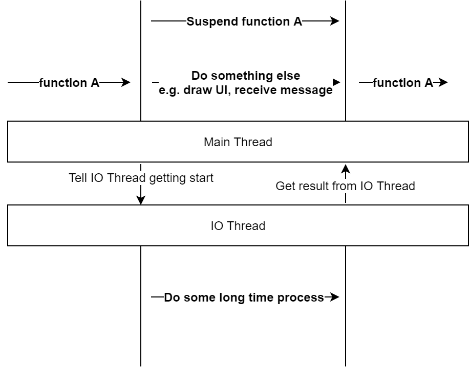

# 基礎

## Coroutine是什麼？

### 概念一

由兩個英文單字組成Cooperation + Routine，Cooperation意指合作，Routine意指例行作業，合在一起就是**合作式例行作業。**

> Routine：通常是方法、功能。

也就是說這些方法、功能會協同其他更多的方法、功能共同作業這件事情稱為Coroutine。

### 概念二

**又稱：可以中斷及繼續執行的函式呼叫**

這句話是在說，允許函式被暫停\(suspended\)執行之後再回復\(resumed\)執行，而暫停執行的函式，狀態允許被保留，復原後再以暫停時的狀態繼續執行．



根據上圖解釋，當main thread執行到function A並且需要等IO thread 耗時處理的結果，那我先暫停 function A，協調讓出main thread讓main thread先去執行其他的事情，等到IO thread的耗時處理結束後得到結果，再回復function A 繼續執行。

### 概念三

Coroutine通常是主動暫停\(suspended\)讓出執行權來實現協作，因此它的本質就是在討論程序控制流程的機制。

與執行緒最大的差異在於，以任務的角度來看，執行緒一旦開始執行就不會暫停，直到任務結束。整個過程是連續的。執行緒之間是搶佔式的調度，因此不存在協作問題。

## 引用

在gradle的dependencies加入

```text
implementation 'org.jetbrains.kotlinx:kotlinx-coroutines-core:1.3.8'
```

使用Android

```text
implementation 'org.jetbrains.kotlinx:kotlinx-coroutines-android:1.3.8'
//for viewmodel
implementation "androidx.lifecycle:lifecycle-viewmodel-ktx:2.2.0"
```

## 簡單的開始

簡單的執行一個Task，在Console印出Hello,World!

* 使用Thread

```text
fun main() {
	thread {
		Thread.sleep(1000L)
		println("World!")
	}
    println("Hello,")
    Thread.sleep(2000L)
}
```

* 使用Coroutine

```text
fun main() {
    GlobalScope.launch {
        delay(1000L)
        println("World!")
    }
    println("Hello,")
    Thread.sleep(2000L)
}
```

以上兩個效果是一樣的，那如果把Coroutine的Thread.sleep\(\)改成delay\(\)，編譯器會錯誤。

```text
Suspend function 'delay' should be called only from a coroutine or another suspend function
```

很明顯編譯器告訴你，一個suspend funcation只能被coroutine或其他suspend funcation使用。

首先我們看一下delay這個方法

```text
public suspend fun delay(timeMillis: Long) {
    ...
}
```

會發現fun前面多了一個suspend的簽名，這是用來告訴編譯器的一個標記，他會被編成[CPS](https://www.youtube.com/watch?v=YrrUCSi72E8)的ByteCode。要解決這問題，我們可以簡單的使用runBlocking，它會幫助我們在Coroutine的Scope上執行．

```text
fun main() = runBlocking<Unit> {
    GlobalScope.launch {
        delay(1000L)
        println("World!")
    }
    println("Hello,")
    delay(2000L)
}
```

從上面的範例，我們使用delay來讓Coroutine延後結束，並不是一個很好的寫法，因為他並沒有清楚的說明Task目的（因為要故意等待，才能阻止整個程式被關閉）。

更好的做法是使用Join\(\)，他會等待Job結束後，才會結束整個Task\(就是這個runBlocking的Coroutine\)

```text
fun main() = runBlocking {
    val job = GlobalScope.launch {
        delay(1000L)
        println("World!")
    }
    println("Hello,")
    job.join()    
}
```


