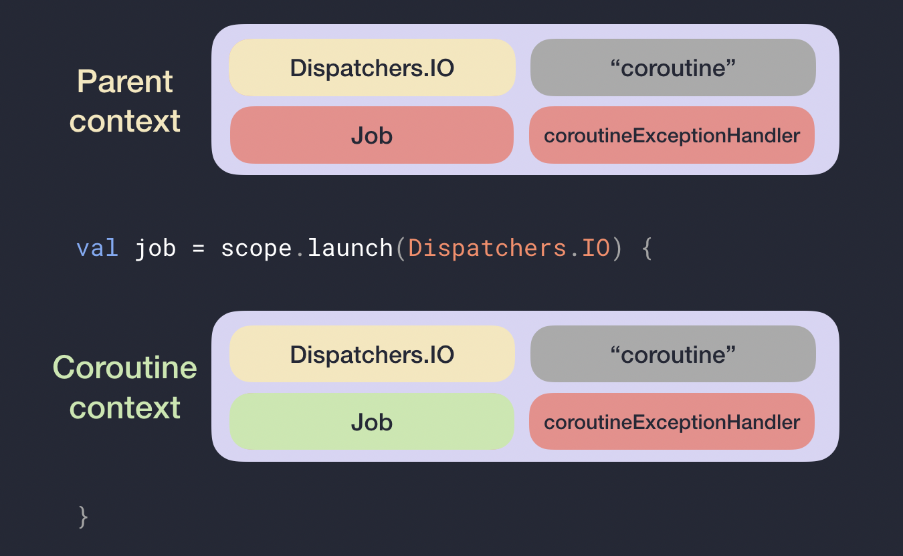

# Scope和Context

## CoroutineScope

Scope指的是範圍，Coroutine作用的範圍，主要用來控制一群Coroutine的生命週期。  
白話一點的描述來說，Scope比較像是一個容器，定義容器內的基本行為，從這個Scope產生出來的Coroutine都會**繼承**這個基本行為。

### 透過Scope產生Coroutine

重要概念：產生Coroutine不一定要透過Scope，Scope是一個容器來做到[Structured Concurrency](https://elizarov.medium.com/structured-concurrency-722d765aa952)，可參考 [Suspend修飾](https://app.gitbook.com/@cmmobile/s/androidbook/~/drafts/-MOZACvGhVINmRDWcDzX/xin-ren-xun-lian/kotlin-coroutine/xian-kuang) 簡單創建一個Coroutine。

在產生Coroutine之前，要先產生一個Scope，CoroutineScope它是一個介面，有一個參數CoroutineContext，在後面會說明它用途，現在只要知道一個Scope會包含一個Context來連結Coroutines的關係。

```text
public interface CoroutineScope {
    public val coroutineContext: CoroutineContext
}
```

在Library的實作

```text
public fun CoroutineScope(context: CoroutineContext): CoroutineScope = ContextScope(if (context[Job] != null) context else context + Job())

internal class ContextScope(context: CoroutineContext) : CoroutineScope {
    override val coroutineContext: CoroutineContext = context
    // CoroutineScope is used intentionally for user-friendly representation
    override fun toString(): String = "CoroutineScope(coroutineContext=$coroutineContext)"
}
```

自己的實作

```text
object : CoroutineScope {
override val coroutineContext: CoroutineContext
    get() = Job()

}
```

不管用哪種方式，CoroutineContext都必須被指定。那如果不想指定CoroutineContext的行為怎麼辦？介面也不能是null。使用EmptyCoroutineContext代替，它是一個object class，所以不管產生幾個都是同一個實體。但建議別這麼做，因為創造了一個不能管理生命週期的Scope是沒有意義的。除非是Application等級的生命週期，當Application被殺掉，理所當然處理Coroutine的Thread正常也會消失，不用特別指定行為。

```text
public object EmptyCoroutineContext : CoroutineContext, Serializable {
    ...
}
```

## CoroutineContext

CoroutineContext是用來定義一個Coroutine的行為的一組元素。  
他的實作元素有下面幾個：

* Job：控管Coroutine生命週期。
* CoroutineDispatcher：把工作分配在合適的Thread上。
* CoroutineName：幫Coroutine命名，在Debug時很好用。
* CoroutineExceptionHandler：處理未抓取的例外，就像是Thread.UncaughtExceptionHandler。

上面說它是一組元素是因為它是可以被組合起來的

```text
CoroutineScope(Job() + Dispatchers.Main + CoroutineName("name1"))
```

### 產生一個新的Coroutine

為了快速使用Coroutine，我們使用runBlocking來launch或async產生一個Coroutine，因為runBlocking會阻塞目前的Thread，所以在實際產品Code千萬不要使用。

```text
fun main() = runBlocking { 
    val job = this.launch(Job()) {
        println("My context is $coroutineContext}")        
    }
    job.join()
}
```

在launch後會回傳新的Coroutine，型別是Job，透過join\(\)使目前的Coroutine suspend。

```text
fun main() = runBlocking { 
    val deferred = this.launch(Job()) {
        println("My context is $coroutineContext}")        
    }
    val result = deferred.await()
}
```

async會回傳一個Deferred代表之後再回來取值，透過await\(\)可以把結果取回來，並使目前的Deferred suspend。

#### launch和async使用時機？

* launch：只想啟動一個Task，不管結果如何。
* async：啟動一個Task，但在特定的位置想知道結果是什麼。

### CoroutineContext繼承關係

一個Coroutine通常會有一個Parent的Scope或是Parent的Coroutine。

**Parent的Context** = 預設 + 繼承的CoroutineContext + 參數

* 預設：CoroutineDispatcher -&gt; Dispatcher.Default，CoroutineName -&gt; "coroutine"。
* 繼承的CoroutineContext：從CoroutineScope或一個Coroutine產生。
* 參數：透過Coroutine建構式傳遞產生，如果有同樣的CoroutineContext元素，優先權會蓋過相同的元素。

**Note**：CoroutineContext可以透過+\(加號\)來進行結合成一組元素。覆蓋規則：加號的右邊會蓋過左邊，例如：\(Dispatcher.Main + "Name"\) + \(Dispatcher.IO\) = \(Dispatcher.IO + "Name"\)。

### Child Coroutine的Context

透過Parent產生的Coroutine Context規則如下：

**新的Coroutine Context** = Parent Context + Job\(\)



從父類別產生的Coroutine實體的Context，總是跟Parent的Context不一樣，會得到一個新的Job。

